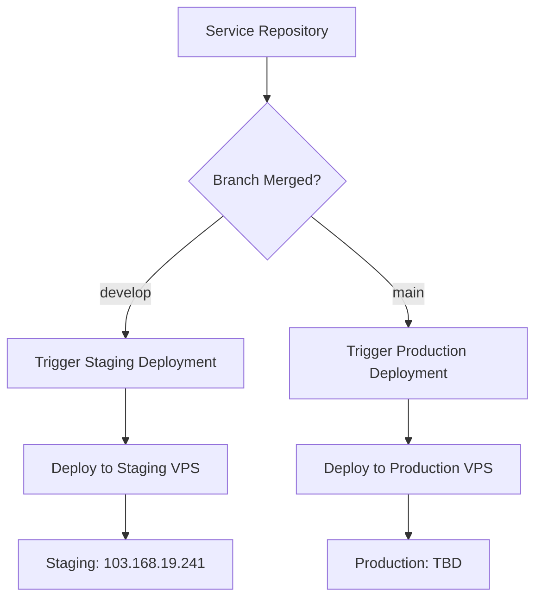

# Branch-Based Automatic Deployment Setup

## 🎯 **Deployment Strategy**

Your deployment system now supports automatic deployments based on branch merges:

- **develop branch** → **staging environment** (103.168.19.241)
- **main branch** → **production environment** (when configured)

## 🏗️ **Architecture Overview**



## ✅ **What's Been Configured**

### 1. **Service Repositories Updated**
- Default branch changed from `main` to `develop` in `service-repositories.json`
- All services now deploy from `develop` branch to staging by default

### 2. **Automatic Deployment Workflows Created**
- **`auto-deploy-staging.yml`** - Deploys from develop branch to staging
- **`auto-deploy-production.yml`** - Deploys from main branch to production
- Both workflows use repository dispatch webhooks

### 3. **Webhook System**
- Each service repository gets a webhook workflow
- Automatically triggers deployment on branch merges
- Supports both staging and production environments

## 🚀 **Setup Process**

### Step 1: Configure Webhooks
```bash
cd deployment
./setup-webhooks.sh
```

This will:
- ✅ Ask for your GitHub organization
- ✅ Create webhook workflows for each service
- ✅ Generate setup scripts
- ✅ Create comprehensive instructions

### Step 2: Install Webhooks in Service Repositories
For each service repository:
```bash
# Navigate to service repository
cd ../auth-service  # or user-service, chat-service, etc.

# Copy and run setup script
cp ../deployment/setup-service-webhooks.sh .
./setup-service-webhooks.sh

# Commit the webhook
git add .github/workflows/deploy-on-merge.yml
git commit -m "Add automatic deployment webhook"
git push origin main
```

### Step 3: Configure GitHub Secrets

**For Each Service Repository:**
- Add `DEPLOYMENT_TOKEN` secret (GitHub Personal Access Token)

**For Deployment Repository:**
- Staging secrets already configured
- Add production secrets when ready:
  - `PROD_VPS_SSH_KEY`
  - `PROD_VPS_HOST`
  - `PROD_VPS_PORT`
  - `PROD_VPS_USER`

## 🔄 **Deployment Flow**

### Staging Deployment (develop branch)
```bash
# In any service repository
git checkout develop
git add .
git commit -m "Feature update"
git push origin develop
# 🚀 Automatically triggers staging deployment
```

### Production Deployment (main branch)
```bash
# In any service repository
git checkout main
git merge develop
git push origin main
# 🚀 Automatically triggers production deployment
```

## 📋 **Workflow Details**

### Staging Deployment Features:
- ✅ Automatic trigger on develop branch push
- ✅ Fast deployment (tests optional)
- ✅ Staging environment variables
- ✅ Health checks
- ✅ Immediate feedback

### Production Deployment Features:
- ✅ Automatic trigger on main branch push
- ✅ **Required tests** (blocks deployment if tests fail)
- ✅ Production environment variables
- ✅ Resource limits (memory, CPU)
- ✅ Automatic backup before deployment
- ✅ **Automatic rollback** on failure
- ✅ Extended health checks

## 🎛️ **Environment Configuration**

### Current Setup (Staging Only)
```json
{
  "staging": {
    "host": "103.168.19.241",
    "port": 7576,
    "user": "root",
    "branch": "develop"
  }
}
```

### Future Production Setup
```json
{
  "production": {
    "host": "your-production-server.com",
    "port": 22,
    "user": "deploy",
    "branch": "main"
  }
}
```

## 🔍 **Monitoring Deployments**

### 1. Service Repository Actions
- Shows webhook trigger status
- Indicates which deployment was triggered

### 2. Deployment Repository Actions
- Shows actual deployment progress
- Build logs and deployment status
- Health check results

### 3. VPS Monitoring
```bash
# Check service status
ssh -p 7576 root@103.168.19.241
docker ps | grep letzgo-
curl http://localhost:3000/health  # Check individual services
```

## 🛠️ **Manual Deployment Options**

You can still deploy manually when needed:

### Manual Staging Deployment
```bash
# GitHub Actions → Auto Deploy to Staging → Run workflow
# Enter service name and repository manually
```

### Manual Multi-Service Deployment
```bash
# GitHub Actions → Deploy Services (Multi-Repository) → Run workflow
# Select multiple services and branches
```

## 📊 **Deployment Matrix**

| Trigger | Branch | Environment | Automatic | Tests Required |
|---------|--------|-------------|-----------|----------------|
| **Push** | develop | Staging | ✅ Yes | ❌ Optional |
| **Push** | main | Production | ✅ Yes | ✅ Required |
| **Manual** | Any | Staging | ❌ Manual | ❌ Optional |
| **Manual** | Any | Production | ❌ Manual | ✅ Required |

## 🔧 **Service Requirements**

Each service repository must have:

### 1. **Package.json Structure**
```json
{
  "name": "service-name",
  "scripts": {
    "start": "node src/server.js",
    "test": "jest"
  }
}
```

### 2. **Health Endpoint**
```javascript
app.get('/health', (req, res) => {
  res.status(200).json({ 
    status: 'healthy', 
    service: 'service-name',
    timestamp: new Date().toISOString()
  });
});
```

### 3. **Environment Support**
```javascript
const port = process.env.PORT || 3000;
const nodeEnv = process.env.NODE_ENV || 'development';
```

## 🚨 **Troubleshooting**

### Webhook Not Triggering
1. Check `DEPLOYMENT_TOKEN` secret in service repository
2. Verify token has `repo` and `workflow` permissions
3. Check Actions tab for webhook errors

### Deployment Failing
1. Check deployment repository Actions tab
2. Verify VPS secrets are correct
3. Check VPS connectivity: `ssh -p 7576 root@103.168.19.241`

### Service Not Starting
1. Check Docker logs: `docker logs letzgo-service-name`
2. Verify health endpoint exists
3. Check environment variables

## 📈 **Benefits**

- ✅ **Automated Deployments**: No manual intervention needed
- ✅ **Branch-Based**: Different environments for different branches
- ✅ **Fast Feedback**: Immediate deployment on code merge
- ✅ **Safe Production**: Tests required, automatic rollback
- ✅ **Independent Services**: Each service deploys independently
- ✅ **Team Efficiency**: Developers can deploy their own services

---

**🎉 Your branch-based automatic deployment system is ready! Services will now deploy automatically when code is merged to develop (staging) or main (production) branches.**
