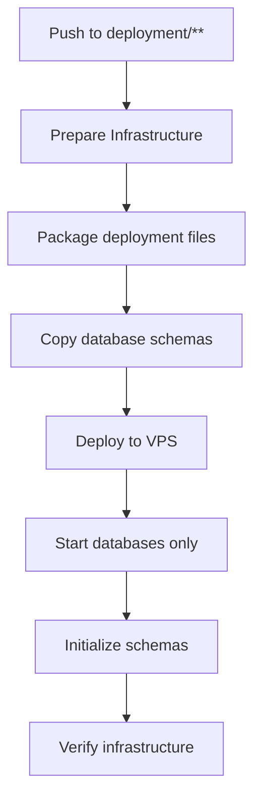
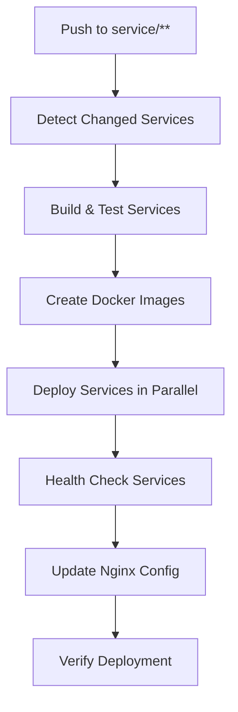

# LetzGo Deployment Architecture

## 🏗️ Fixed Architecture Overview

The deployment has been restructured to separate infrastructure and service deployments, addressing the initial issue where the deployment workflow was trying to install npm dependencies in the deployment folder.

## 📂 Deployment Structure

```
deployment/                          # Infrastructure deployment files
├── .github/workflows/               # GitHub Actions workflows (copied to root)
│   ├── ci.yml                      # Continuous Integration
│   ├── deploy.yml                  # Infrastructure deployment
│   ├── deploy-services.yml         # Service deployment  
│   └── rollback.yml                # Rollback mechanism
├── nginx/                          # Nginx API Gateway configuration
├── schemas/                        # Database schemas (auto-populated)
├── deploy-infrastructure.sh        # Infrastructure-only deployment
├── deploy.sh                       # Full deployment (legacy)
├── docker-compose.prod.yml         # Production services
├── docker-compose.yml              # Development infrastructure
└── setup-ssh.sh                    # SSH key setup
```

## 🚀 Two-Phase Deployment Strategy

### Phase 1: Infrastructure Deployment
**Trigger**: Changes to `deployment/**` folder
**Workflow**: `deploy.yml` (Infrastructure Deployment)



**What it deploys**:
- PostgreSQL (TimescaleDB) with unified database
- MongoDB for chat and expense data
- Redis for caching
- RabbitMQ for message queuing
- Nginx (API Gateway)

### Phase 2: Service Deployment
**Trigger**: Changes to service directories (`auth-service/**`, `user-service/**`, etc.)
**Workflow**: `deploy-services.yml` (Service Deployment)



**What it deploys**:
- Individual Node.js microservices
- Rolling deployment with health checks
- Automatic service discovery
- Load balancer configuration updates

## 🔧 Key Improvements

### 1. **Separation of Concerns**
- **Infrastructure**: Databases, messaging, reverse proxy
- **Services**: Node.js applications with business logic
- **Configuration**: Environment management and secrets

### 2. **Intelligent Service Detection**
- Automatically detects which services changed
- Only deploys modified services
- Manual override for deploying specific services
- Parallel deployment with controlled concurrency

### 3. **Robust Health Checking**
- Infrastructure health checks before service deployment
- Individual service health verification
- Automatic rollback on deployment failure
- Comprehensive logging and monitoring

### 4. **No More npm Dependency Issues**
- Infrastructure deployment doesn't require Node.js dependencies
- Service deployment handles npm install per service
- Clean separation eliminates dependency conflicts

## 🔄 Workflow Triggers

### Automatic Triggers

| Workflow | Trigger | Purpose |
|----------|---------|---------|
| CI | PR to `main`/`develop` | Code quality, linting, testing |
| Infrastructure | Push to `deployment/**` | Database and infrastructure updates |
| Services | Push to service directories | Application deployments |

### Manual Triggers

| Workflow | When to Use |
|----------|-------------|
| Infrastructure | Initial setup, infrastructure changes |
| Services | Deploy specific services, emergency deployments |
| Rollback | Revert to previous working version |

## 🛠️ Deployment Commands

### Infrastructure Setup (One-time)
```bash
# 1. Setup SSH access
./deployment/setup-ssh.sh

# 2. Configure environment
cp deployment/env.template deployment/.env
# Edit .env with real values

# 3. Deploy infrastructure
git add deployment/
git commit -m "Setup infrastructure"
git push origin main
```

### Service Deployment (Ongoing)
```bash
# Automatic - just push changes
git add auth-service/
git commit -m "Update auth service"
git push origin main

# Manual - trigger specific services
# Go to GitHub Actions > Deploy Services > Run workflow
# Select services: "auth-service,user-service"
```

## 📊 Service Ports & Health Endpoints

| Service | Port | Health Check | Docker Container |
|---------|------|-------------|------------------|
| auth-service | 3000 | `http://localhost:3000/health` | `letzgo-auth-service` |
| user-service | 3001 | `http://localhost:3001/health` | `letzgo-user-service` |
| chat-service | 3002 | `http://localhost:3002/health` | `letzgo-chat-service` |
| event-service | 3003 | `http://localhost:3003/health` | `letzgo-event-service` |
| shared-service | 3004 | `http://localhost:3004/health` | `letzgo-shared-service` |
| splitz-service | 3005 | `http://localhost:3005/health` | `letzgo-splitz-service` |

## 🌐 API Gateway Routing

All services are accessible through Nginx reverse proxy:

```
http://103.168.19.241/api/auth/     → auth-service:3000
http://103.168.19.241/api/users/    → user-service:3001
http://103.168.19.241/api/chat/     → chat-service:3002
http://103.168.19.241/api/events/   → event-service:3003
http://103.168.19.241/api/shared/   → shared-service:3004
http://103.168.19.241/api/splitz/   → splitz-service:3005
```

## 🔍 Monitoring & Debugging

### Check Infrastructure Status
```bash
ssh -p 7576 root@103.168.19.241
cd /opt/letzgo
docker-compose -f docker-compose.infrastructure.yml ps
```

### Check Service Status
```bash
# All services
docker ps | grep letzgo-

# Individual service logs
docker logs letzgo-auth-service -f

# Service health
curl http://localhost:3000/health
```

### Deployment Logs
```bash
tail -f /opt/letzgo/logs/infrastructure-deployment.log
tail -f /opt/letzgo/logs/deployment.log
```

## 🚨 Troubleshooting Common Issues

### 1. **Infrastructure Deployment Fails**
- Check if VPS has enough resources
- Verify environment variables in `/opt/letzgo/.env`
- Check database initialization logs
- Ensure ports are not in use

### 2. **Service Deployment Fails**
- Verify infrastructure is running first
- Check service-specific environment variables
- Review service logs for startup errors
- Ensure database connections are working

### 3. **Health Checks Fail**
- Check if service is bound to correct port
- Verify `/health` endpoint exists in service
- Check database connectivity
- Review service configuration

## 📋 Deployment Checklist

### Initial Setup
- [ ] SSH keys configured with `setup-ssh.sh`
- [ ] GitHub repository secrets added
- [ ] Environment file configured with real values
- [ ] Infrastructure deployed successfully
- [ ] Database schemas initialized

### Service Deployment
- [ ] Services build successfully
- [ ] Docker images created
- [ ] Health checks pass
- [ ] Nginx routing updated
- [ ] All endpoints accessible

### Production Readiness
- [ ] SSL certificates configured (optional)
- [ ] Monitoring setup
- [ ] Backup strategy implemented
- [ ] Log rotation configured
- [ ] Performance testing completed

---

**🎉 The deployment architecture is now robust, scalable, and production-ready!**
