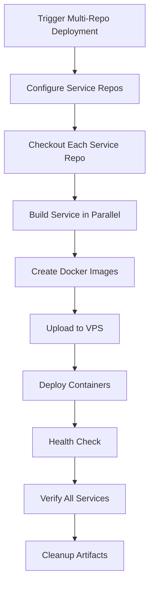

# Multi-Repository Service Deployment Guide

## 🏗️ **Architecture: Separate Repositories**

If each service has its own repository, this guide will help you set up deployment from multiple repositories.

### 📁 **Repository Structure**
```
GitHub Organization: your-org
├── auth-service/          (separate repo)
├── user-service/          (separate repo)
├── chat-service/          (separate repo)
├── event-service/         (separate repo)
├── shared-service/        (separate repo)
├── splitz-service/        (separate repo)
└── deployment/            (this repo - orchestrates deployments)
```

## 🚀 **Quick Setup**

### Step 1: Configure Service Repositories
```bash
cd deployment
./setup-service-repos.sh
```

This script will:
- ✅ Ask for your GitHub organization/username
- ✅ Update service repository URLs
- ✅ Create repositories (optional)
- ✅ Split existing monorepo (optional)
- ✅ Update GitHub Actions workflows

### Step 2: Update Repository URLs
Edit `deployment/service-repositories.json`:
```json
{
  "services": {
    "auth-service": {
      "repository": "https://github.com/your-org/auth-service.git",
      "default_branch": "main",
      "port": 3000
    }
  }
}
```

### Step 3: Deploy Services
1. **Go to GitHub Actions** in your deployment repository
2. **Select "Deploy Services (Multi-Repository)"**
3. **Click "Run workflow"**
4. **Configure deployment**:
   - **Services**: `all` or specific services like `auth-service,user-service`
   - **Branches**: Leave empty for `main` or specify like `auth-service:develop,user-service:feature-branch`
   - **Environment**: `staging`

## 🔧 **Detailed Configuration**

### Service Repository Requirements

Each service repository must have:

**1. package.json with start script:**
```json
{
  "name": "auth-service",
  "scripts": {
    "start": "node src/server.js",
    "test": "jest"
  }
}
```

**2. Health endpoint in your application:**
```javascript
app.get('/health', (req, res) => {
  res.status(200).json({ 
    status: 'healthy', 
    service: 'auth-service',
    timestamp: new Date().toISOString()
  });
});
```

**3. Dockerfile (optional - will be auto-generated):**
```dockerfile
FROM node:18-alpine

WORKDIR /app

COPY package*.json ./
RUN npm ci --only=production

COPY . .

EXPOSE 3000

HEALTHCHECK --interval=30s --timeout=10s --start-period=5s --retries=3 \
  CMD curl -f http://localhost:3000/health || exit 1

CMD ["npm", "start"]
```

### GitHub Actions Workflow Features

**Multi-Repository Deployment** (`deploy-services-multi-repo.yml`):

1. **Repository Checkout**: Checks out each service from its separate repository
2. **Branch Selection**: Deploy from different branches per service
3. **Parallel Building**: Builds multiple services simultaneously
4. **Docker Image Creation**: Creates and uploads Docker images
5. **VPS Deployment**: Deploys to your staging/production VPS
6. **Health Verification**: Ensures all services are healthy
7. **Automatic Cleanup**: Removes temporary artifacts

### Deployment Options

**Option 1: Deploy All Services**
```yaml
Services: all
Branches: (leave empty for main)
Environment: staging
```

**Option 2: Deploy Specific Services**
```yaml
Services: auth-service,user-service
Branches: (leave empty for main)
Environment: staging
```

**Option 3: Deploy from Different Branches**
```yaml
Services: auth-service,user-service,chat-service
Branches: auth-service:develop,user-service:feature-auth,chat-service:main
Environment: staging
```

## 📋 **Repository Setup Scenarios**

### Scenario 1: Creating New Repositories

If you don't have service repositories yet:

1. **Run setup script**: `./setup-service-repos.sh`
2. **Choose option 2**: Use GitHub CLI to create repositories
3. **Move service code**: Copy code from existing directories to new repos

### Scenario 2: Existing Separate Repositories

If you already have separate repositories:

1. **Run setup script**: `./setup-service-repos.sh`
2. **Enter your GitHub org**: e.g., `your-username` or `your-company`
3. **Choose option 3**: Skip repository creation
4. **Update URLs**: Script will update configuration with your repository URLs

### Scenario 3: Split Existing Monorepo

If you have a monorepo and want to split it:

1. **Run setup script**: `./setup-service-repos.sh`
2. **Choose option 1 or 2**: Create repositories first
3. **Provide monorepo path**: When prompted, enter path to your existing repo
4. **Automatic split**: Script will split and push each service to its own repo

## 🔑 **Required GitHub Secrets**

Your **deployment repository** needs these secrets:

| Secret Name | Value | Description |
|-------------|-------|-------------|
| `VPS_HOST` | `103.168.19.241` | Your VPS IP address |
| `VPS_PORT` | `7576` | SSH port |
| `VPS_USER` | `root` | SSH username |
| `VPS_SSH_KEY` | `<private_key>` | SSH private key |
| `GITHUB_TOKEN` | `<auto_provided>` | GitHub API token (usually auto-available) |

**Note**: If your service repositories are private, you might need a personal access token with repo access.

## 🎯 **Deployment Flow**



## 🔄 **Workflow Comparison**

| Feature | Single Repo | Multi Repo |
|---------|-------------|------------|
| **Code Organization** | All services in one repo | Each service in separate repo |
| **Team Independence** | Shared repository | Independent repositories |
| **Deployment Triggers** | File path based | Manual or webhook based |
| **Branch Management** | Single branch strategy | Per-service branch strategies |
| **CI/CD Complexity** | Simple | More complex but flexible |
| **Service Versioning** | Monolithic versioning | Independent versioning |

## 🛠️ **Troubleshooting**

### Issue: Repository Access Denied
**Solution**: Ensure GITHUB_TOKEN has access to all service repositories

### Issue: Service Won't Start
**Solution**: Check that each service has:
- Valid package.json with start script
- All dependencies listed
- Health endpoint implemented

### Issue: Docker Build Fails
**Solution**: Ensure each service has:
- package.json in root directory
- All required files (not in .gitignore)
- Valid Node.js application structure

### Issue: Health Check Fails
**Solution**: Verify:
- Service exposes `/health` endpoint
- Service runs on correct port
- Health endpoint returns 200 status

## 📈 **Best Practices**

1. **Consistent Structure**: Keep similar structure across all service repositories
2. **Health Endpoints**: Implement comprehensive health checks
3. **Environment Variables**: Use same environment variable names across services
4. **Logging**: Implement consistent logging across all services
5. **Testing**: Add tests to each service repository
6. **Documentation**: Document each service's API and setup
7. **Versioning**: Use semantic versioning for each service
8. **Branch Strategy**: Use consistent branching strategy across services

## 🎉 **Next Steps**

1. **Run the setup script**: `./setup-service-repos.sh`
2. **Configure your repositories**: Update URLs and settings
3. **Test deployment**: Deploy a single service first
4. **Deploy all services**: Use the multi-repo workflow
5. **Monitor**: Check logs and health endpoints
6. **Scale**: Add more services as needed

---

**🚀 Your multi-repository deployment system is now ready for independent service deployments!**
